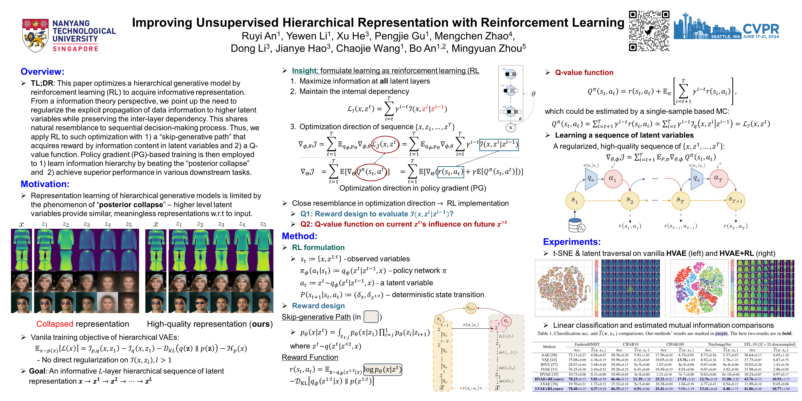

<div align="center">

<h1>Improving Unsupervised Hierarchical Representation with Reinforcement Learning</h1>

<!-- Ruyi An, Yewen Li, Xu He, Pengjie Gu, Mengchen Zhao, Dong Li, Jianye HAO, Chaojie Wang, Bo An, Mingyuan Zhou -->

<div>
    Ruyi An&emsp;
    Yewen Li&emsp;
    Xu He&emsp;
    Pengjie Gu&emsp;
    Mengchen Zhao&emsp;
    Dong Li&emsp;
    Jianye Hao&emsp;
    Chaojie Wang&emsp;
    Bo An&emsp;
    Mingyuan Zhou
</div>

<div>
    🎈 <strong>Accepted to CVPR 2024</strong>
</div>

<div>
    <h4 align="center">
        • <a href="https://openaccess.thecvf.com/content/CVPR2024/papers/An_Improving_Unsupervised_Hierarchical_Representation_with_Reinforcement_Learning_CVPR_2024_paper.pdf" target='_blank'>[pdf]</a> •
    </h4>
</div>



<div>
    If you find our project helpful, kindly consider ⭐ this repo. Thanks! 🖐️
</div>

</div>

## 📮 News
- Jun. 2024: We will be presenting our paper at CVPR 2024.
- May 2024: We released the codebase for this project.

## 🛠️ Installation
### Codes and Environment
```bash
# clone this repository
git clone https://github.com/ruyianry/rep_hierarchy_rl.git
cd rep_hierarchy_rl

# create a new anaconda environment
conda create -n rephrl python=3.8 -y
conda activate rephrl

# install python dependencies
conda install -y -c pytorch pytorch torchvision torchaudio cudatoolkit=11.8
pip install -r requirements.txt
pip install --editable .
```

Ensure that the CUDA version used by `torch` corresponds to the one on the device.

### Package testing
```bash
pytest -v --cov --cov-report=term tests
```
Please run the above check to ensure that the code works as expected on your system.


## 🏃Training
The below commands will train a HVAE with reinforcement learning on FashionMNIST and CIFAR-10 datasets.

The dataset will be downloaded automatically if it is not found in the `data` directory via `torchvision.datasets`.

### FashionMNIST
```bash
python3 scripts/dvae_run_FashionMNIST_RLQ.py
```

### CIFAR-10
```bash
python3 scripts/dvae_run_CIFAR10_RLQ.py
```

The other datasets can be trained by modifying the `train_datasets` parameter in the script.

## 🔝 Citation
If you find our work useful for your research, kindly consider citing our paper:
```bibtex
@inproceedings{hier_rep_rl,
  title={Improving Unsupervised Hierarchical Representation with Reinforcement Learning},
  author={An, Ruyi and Li, Yewen and He, Xu and Gu, Pengjie and Zhao, Mengchen and Li, Dong and Hao, Jianye and An, Bo and Wang, Chaojie and Zhou, Mingyuan},
  booktitle={{CVPR}},
  year={2024}
}
```

## 🖖 Acknowledgement
This implementation is based on the following repositories:
- [hvae-oodd](https://github.com/JakobHavtorn/hvae-oodd)
- [biva-pytorch](https://github.com/vlievin/biva-pytorch)

🫡 Salute!

## ☎️ Contact
Please feel free to reach us out at `ran003😎ntu.edu.sg` should you need any help.
